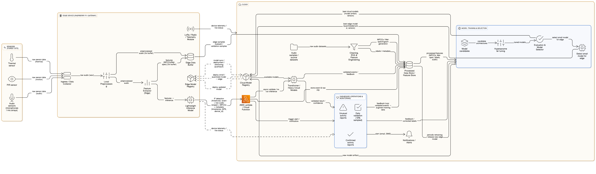
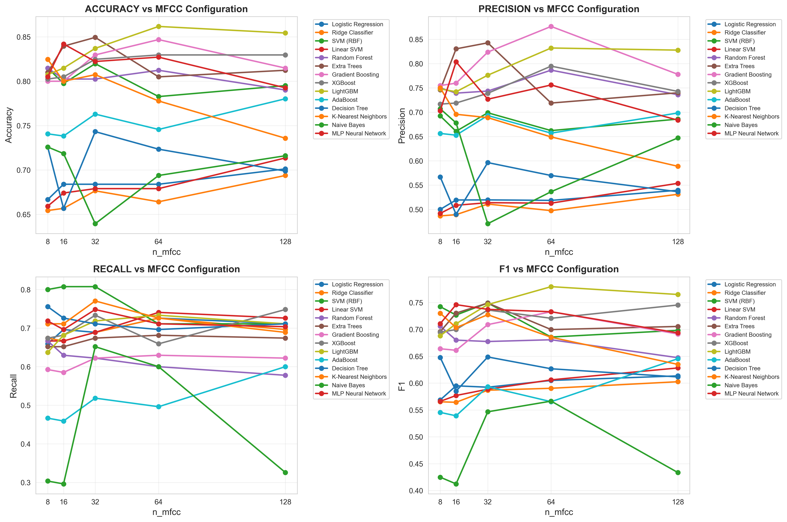
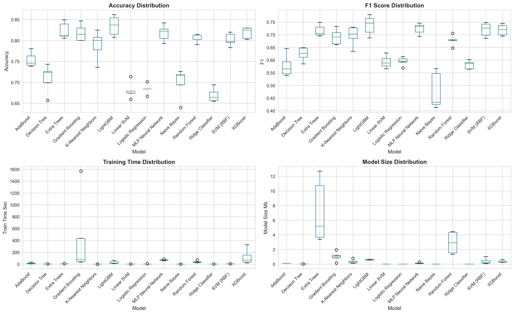
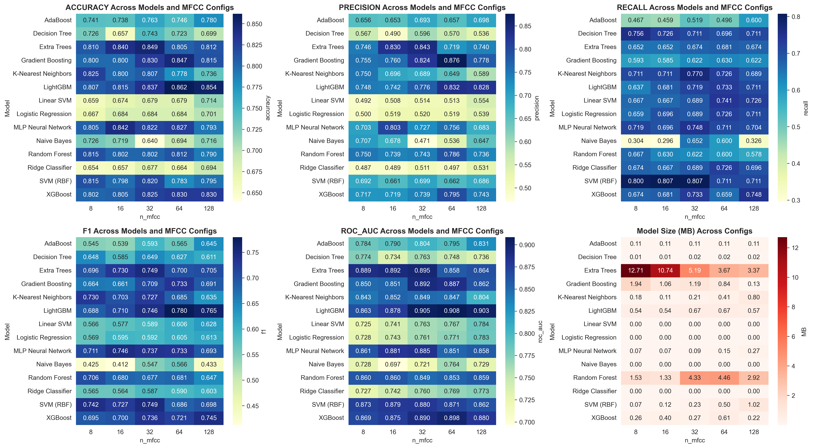
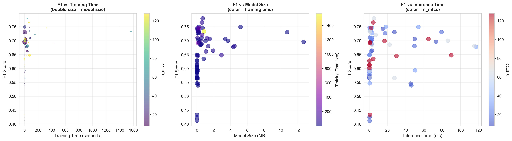

# Forest Audio Classification ML-Ops Pipeline

## Overview



This project implements a hybrid **edge-cloud system** for the real-time detection of illegal logging and other forest threats. It leverages a distributed network of **Raspberry Pi edge devices** equipped with microphones and environmental sensors to monitor forest environments. The system uses **machine learning models** to detect chainsaw activity and other anomalies, sending real-time alerts to a scalable cloud platform for further processing, model improvement, and centralized monitoring.

---

## Key Features

- **Edge Detection:**  
  - Raspberry Pi nodes run lightweight ML models for instant detection of chainsaw sounds.
  - Immediate transmission of alerts (with GPS) to the cloud upon detection.
  - Local monitoring for forest fires and device tampering using thermal and motion sensors.






- **Cloud Platform:**  
  - Ingests real-time alerts and raw audio data from edge devices.
  - Runs a production-grade ML pipeline for advanced model training and evaluation.
  - Automated MLOps workflow using MLflow and DVC for continuous model improvement and deployment.
  - Centralized dashboard for real-time alerts, device health, and environmental data.

- **Extensible:**  
  - Easily adaptable to detect other threats (e.g., gunshots for anti-poaching).
  - Modular pipeline for rapid experimentation and deployment.

---

## Project Structure

```
code/
    basic_model_train.ipynb
    code/pipeline.py
    code/preprocessing.ipynb
    dvc_data/
    logs/
    mlflow_artifacts/
    mlruns/
    plots/
data/
    data/metadata.csv
    audio/
    meta/
    processed_audio/
docs/
literature/
models/
```

- **code/**: Main pipeline, notebooks, and scripts.
- **data/**: Raw and processed audio data, metadata.
- **logs/**: Pipeline logs.
- **mlflow_artifacts/**, **mlruns/**: MLflow experiment tracking and artifacts.
- **plots/**: Model comparison and evaluation plots.
- **models/**: Saved and registered models.

---

## Pipeline Highlights

- **Preprocessing:**  
  - Feature extraction (MFCCs, Mel spectrograms) from audio files.
  - Configurable parameters for sample rate, duration, and feature dimensions.

- **Model Training & Evaluation:**  
  - Supports Logistic Regression, Random Forest, SVM, LightGBM, and XGBoost (if installed).
  - Grid search with cross-validation for hyperparameter tuning.
  - MLflow integration for experiment tracking, parameter logging, metrics, and artifact storage.
  - Automatic model registration and versioning.

- **MLOps & Automation:**  
  - DVC integration for data and pipeline versioning.
  - Automated pipeline stages: preprocess, train, full.
  - Model inference utilities for batch and single-file prediction.

---

## Quickstart

### 1. Install Requirements

```sh
pip install mlflow pandas numpy scikit-learn librosa matplotlib seaborn tqdm joblib
pip install lightgbm xgboost  # optional, for additional models
pip install dvc               # for data version control
```

### 2. (Optional) Create a Custom Config

```sh
python code/pipeline.py --create-config
# Edit pipeline_config_template.json as needed
```

### 3. Run the Pipeline

- **Full pipeline:**
  ```sh
  python code/pipeline.py
  ```
- **With custom config:**
  ```sh
  python code/pipeline.py --config your_config.json
  ```
- **Specific stages:**
  ```sh
  python code/pipeline.py --stage preprocess
  python code/pipeline.py --stage train
  ```

### 4. View MLflow UI

```sh
mlflow ui
# Open http://localhost:5000 in your browser
```

### 5. DVC Integration

```sh
dvc init
dvc add data/audio
dvc add data/metadata.csv
dvc repro
```

---

## Inference Example

```python
from code.pipeline import ModelInference

inference = ModelInference()
result = inference.predict_audio_file("path/to/new/audio.wav")
print(result)
```